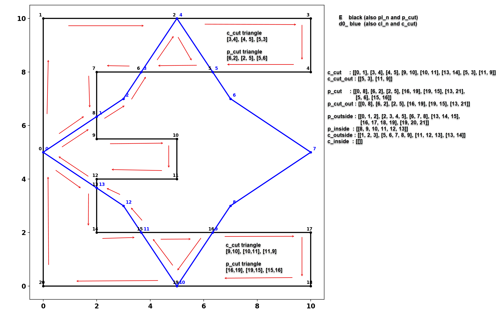

# Overlay_ops
Overlay operations with polygons

**Python, NumPy polygon overlay operations for concave and convex polygons.**

Source code is part of numpy_geometry... `npg`.

Currently not linked... [Polygon clipping source code.](https://github.com/Dan-Patterson/numpy_geometry/blob/master/arcpro_npg/npg/npg/old/npg_boolean.py)

Related discussions

[Clipping discussion and example.](https://github.com/Dan-Patterson/geonumeracy/blob/main/docs/clipping/clip.md)

Overlay operations with polygons can include, removing/acquiring parts from each other (eg. clipping, erasing), finding their differences or common areas.
To this end, I employed:
- a winding number algorithm is used to determine which points were inside, outside and on the perimeter of the input polygons.
- intersections are made on the polygon perimeters and those points were classified.
- the intersection points were simplified to the bare minimum as a crossings array which denotes which segments crossed and hence which points were involved.
  - using a bit of logic, either a clipping segment crosses another segment on the polygon to clip's segment, or at one of its endpoints.
  - a clipping segment can start inside or outside or on the polygon perimeter and they can meet begin/end on polygon vertices.
- the final step is to look at the polygon parts after their division and determine how to classify them.

A few approaches were examined and these will be discussed in time.

Continue....
